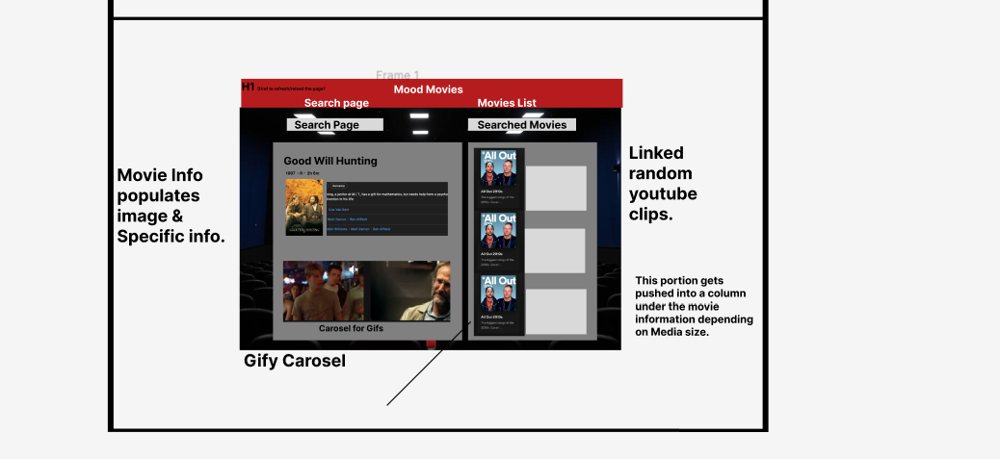
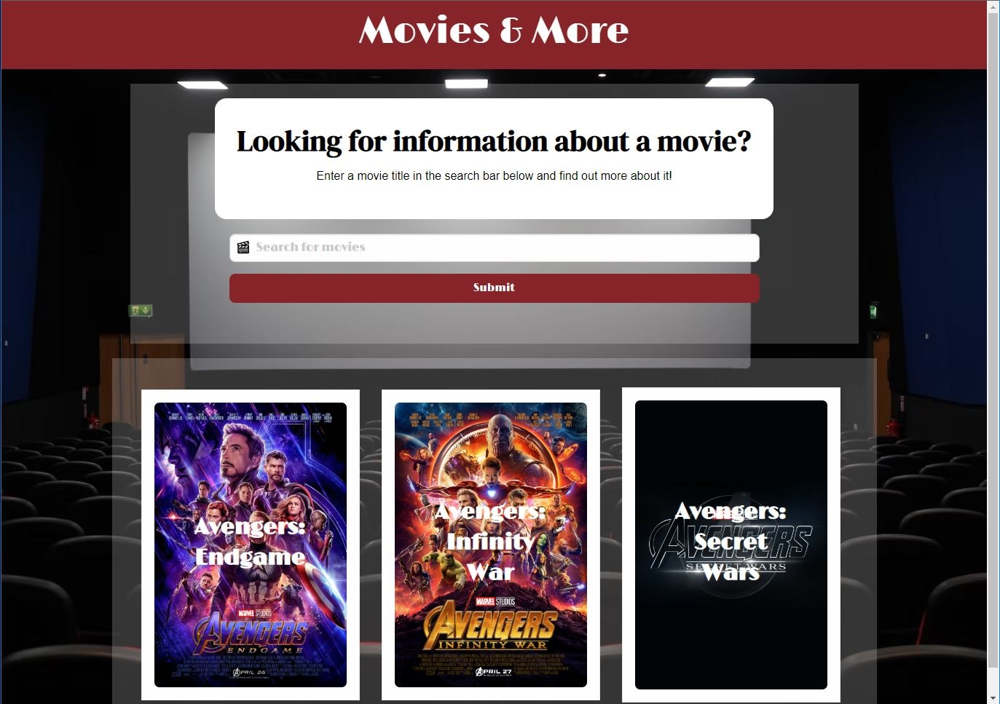
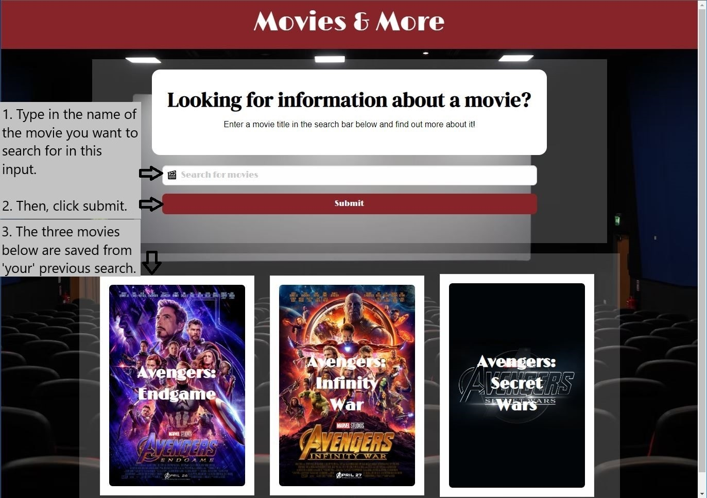
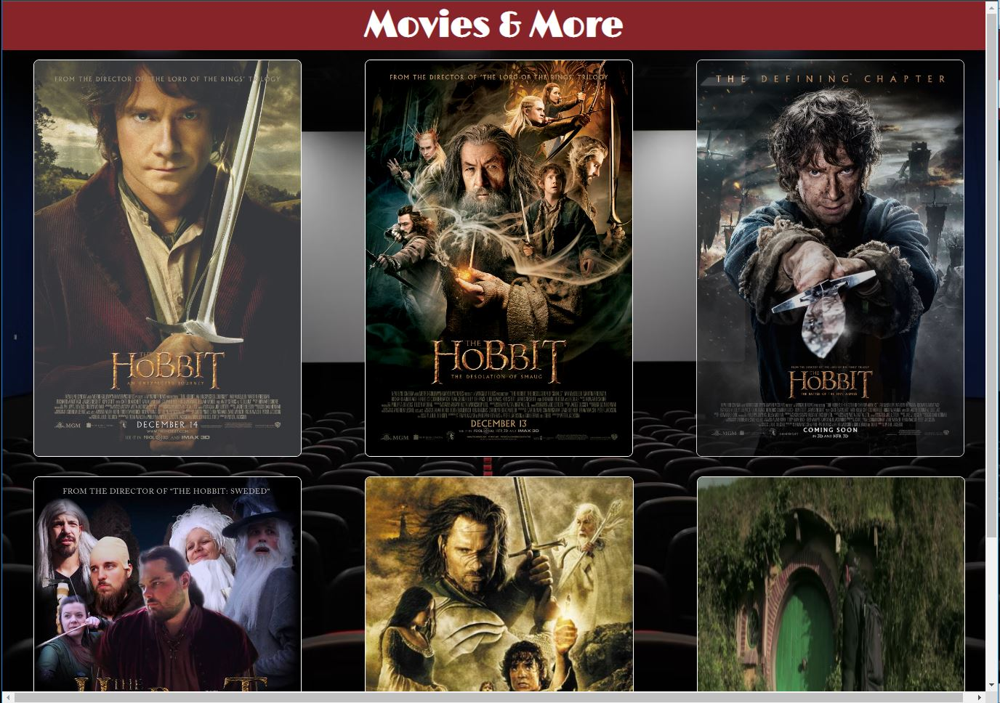
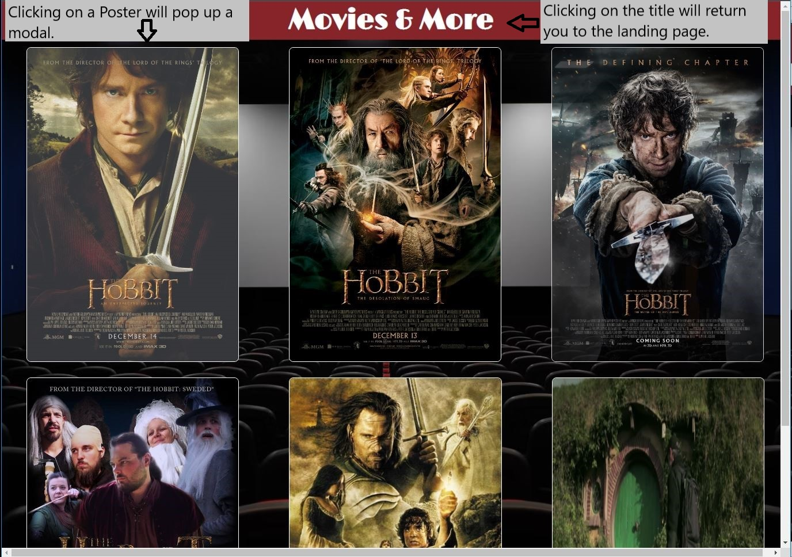
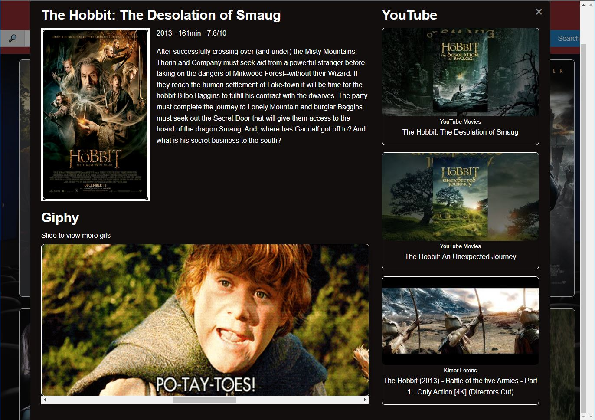
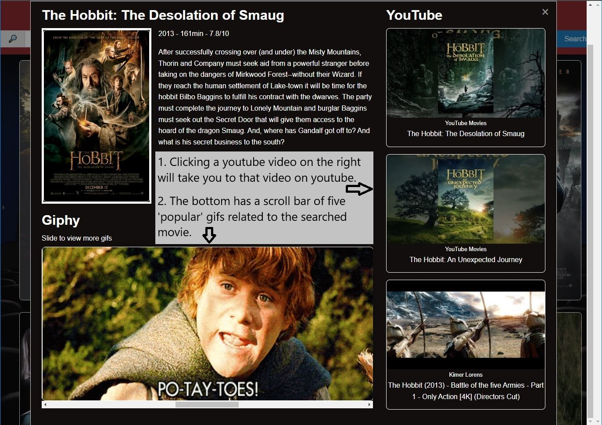

# Movies & More

Project Goal: Collaboratively build a front-end web application that helps with a need in the world.

Deployed Link: https://sarahthoorens.github.io/movies-and-more/ </br>
Deployed Date: 10/13/22

### Contributors
  Yeon Seo: https://github.com/rogseo</br>
  Cody Berry: https://github.com/Krimeas</br>
  Katherine Maddox: https://github.com/kmaddox2122</br>
  Sarah Thoorens: https://github.com/sarahthoorens


## Project Description

We created a space for the movie enthusiast and those who are movie-curious to search for a title and find fun and interesting information related to a movie. By pulling API's from Giphy.com and YouTube.com we added some fun to what would otherwise be a mundane IMDb search. Our site pulls the movie poster, plot and rating information from IMDb via Online Movie Database API and brings it together with movie-related GIFs and linked YouTube clips in one nifty modal.  

## Application functionality

When the main page loads, the user is presented with a header with the website title, a search box just below, and three movie posters from the user's most recent search (if applicable). When the user provides a title input, they're taken to a second html page displaying six related movie poster titles. The movie titles are subtly overlayed on the posters, and when the user clicks on poster, the related modal will pop out with movie information, a reel of up to five gifs and three snippets showing linked YouTube clips. The user can exit the modal and choose a different movie from the six titles or click the linked website title to return to the homepage for a new search. 

## Challenges

The most significant challenge for this project was implementing smooth version control with GitHub. This was the first group project for every team member that requiredversion control, and the learning curve felt steep. 

Additionally, configuring the modal to contain every API element required a real team effort. And, settling on an effective method of transfering the user from the home page to the "listing" page required some significant research. Eventually, we settled on utilizing session storage to transfer the search query data and run the functions needed on page 2. 

## Lessons Learned

Despite the version control challenges, we persisted and eventually gained the experience needed to commit and share information effectively. This project required significant clear communication from every member, so we held stand-ups every evening to assess where each member was, check if anyone needed help and discuss plans for the next day. 

Although we had many ideas on additional features to add to our product, we focused on producing a viable product first, hoping we would be able to add on any cosmetic changes or minor additions if time permitted. This was a winning strategy for us that we'll take forward into future projects. 

## Acceptance Criteria
- If you search a movie by title, you will find 6 results on a new page.
- On this new page, you are presented with poster images of the movie that you search or those with similar titles.
- When you hover over the images, you can see the movie title and click it to get more information in a pop-out modal.
- The modal includes movie details (runtime, release year, plot, poster image, title and rating), 3 related YouTube thumbnails + their links, and a carousel of 5 related gifs.
- Your search value is saved in local storage, and upon refresh, it will render 3 movie posters from your last search on the home page.

</br>
</br>

## Project Requirements Provided
```
You and your group will use everything you’ve learned over the past six modules to create a real-world front-end application that you’ll be able to showcase to potential employers. The user story and acceptance criteria will depend on the project that you create, but your project must fulfil the following requirements:

* Use a CSS framework other than Bootstrap.

* Be deployed to GitHub Pages.

* Be interactive (i.e., accept and respond to user input).

* Use at least two [server-side APIs](https://coding-boot-camp.github.io/full-stack/apis/api-resources).

* Does not use alerts, confirms, or prompts (use modals).

* Use client-side storage to store persistent data.

* Be responsive.

* Have a polished UI.

* Have a clean repository that meets quality coding standards (file structure, naming conventions, follows best practices for class/id naming conventions, indentation, quality comments, etc.).

* Have a quality README (with unique name, description, technologies used, screenshot, and link to deployed application).
```

------------------------------------------------------------
#### Initial Wireframe


</br>

</br>

#### Website Flow

<!-- first Image -->

</br>
<!-- Second Image -->

</br>
<!-- Third Image -->

</br>
<!-- Fourth Image -->

</br>
<!-- Fifth Image -->

</br>
<!-- Sixth Image -->



------------------------------------------------------------

### Technologies used in this project were:
  1. HTML
  2. Javascript and jQuery
  3. VSCode
  4. Google Slides and Google Fonts
  5. Foundation CSS and vanilla CSS
  6. GitHub, CLI and GitBash for windows
  7. Chrome Web Browser & Dev Tools

------------------------------------------------------------

## Future Development Plans
- Make search history link to the movie's modal
- Increase the number of returned movies (currently limited by API limits)
- Search by other criteria such as actor or director
- Add filtering such as:  services, genre, type
- In addition to recent searches, add a top 10 and other playful features to the landing page
- Add links showing what streaming service provider you could actually watch the movie on
-----------
-----------

#### Additional Sources:
  - Carousel for gifs - https://css-tricks.com/css-only-carousel/
  - Movie API - Online Movie Database : https://rapidapi.com/apidojo/api/online-movie-database
  - YouTube API - https://developers.google.com/youtube/v3
  - Giphy API - https://developers.giphy.com/
  - UTA Bootcamp previous homework/lecture materials.

Task details supplied by UT Austin Coding Bootcamp.

This code follows the MIT License!
